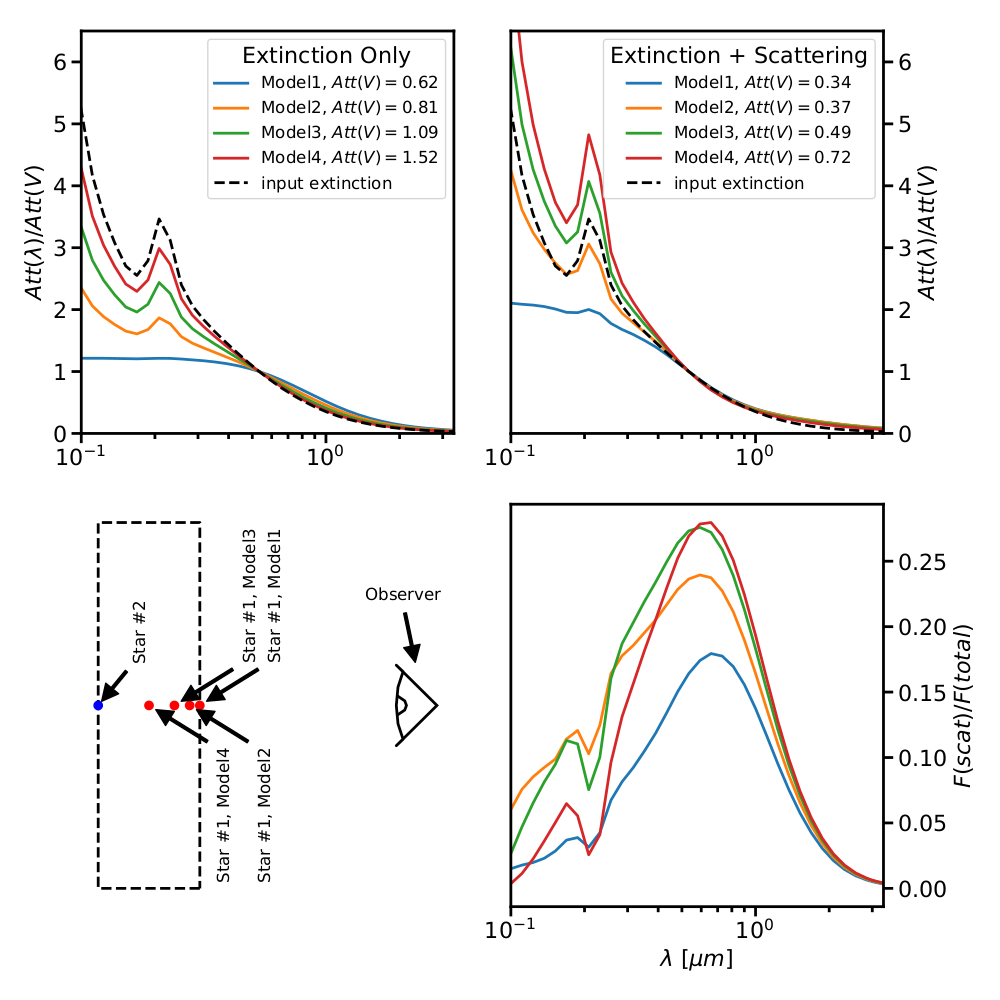

.. _AttvsExt:

#############################
Attenuation versus Extinction
#############################

.. note:: All extinction curves are attenuation curves, but not all attenuation
          curves are extinction curves.

Attenuation
===========

Interstellar dust absorbs and scatters photons re-emitting the majority of the
absorbed energy in the infrared.
Dust attenuation refers to the general impact of dust absorption and scattering
on the spectrum of an object due to the presence of dust.  Attenuation does
not include the impact of the dust re-emission on an object's spectrum.
In general, the term attenuation is used to indicate that the
geometry of the sources and dust in a system is more complex than a single star
with a foreground screen of dust.  In this simple case, the effects of foreground
dust on a single star are termed extinction to distinguish it from
the more complex geometrical cases.  Examples of such complex geometries exhibiting
attenuation
include dusty galaxies (composed of many stars) and stars with circumstellar dust.

Measuring attenuation for an object is nominally as straightforward as measuring
extinction.  The spectrum of the object with dust is compared to an equivalent
object with no dust.  In reality, this is quite hard as the usual objects for
such work are galaxies and no two galaxies are similar enough.  This can and has
been done for samples of galaxies (e.g., starbursts: Calzetti et al. 1994, 2000;
local galaxies: Wild et al. 2011, Battisti et al. 2016, 2017;
& distant galaxies: Reddy et al. 2015.) or by
using a model for the stellar populations and attenuation shape in that galaxy
(e.g., Conroy 2010; Buat et al., 2011, 2012, 2018;  Kriek & Conroy, 2013;
Salmon et al., 2016).

Theoretically calculating the attenuation curves can be done using dust
radiative transfer models.  As a result, the effects of multiple sources  and
scattering into the observed beam are sometimes referred to as radiative
transfer effects.  Such radiative transfer calculations require specifying the
geometry of the photon emitters (stars) and dust grains as well as the grain
details (size, shape, composition).

Attenuation includes the effects of having multiple sources extinguished by
different columns of dust and the scattering of photons into the observation
beam.  Unlike extinction, these two effects mean that the attenuation is not
directly proportional to the amount of dust in the system. Hence the ratio of
attenuations at two different wavelengths *varies* with the amount total system
dust. In other words, the shape of the attenuation curve varies with the
total amount of dust in the system unlike the case for extinction.
This is illustrated below with "WG00" shell, clumpy, mw models, where the
left plot shows the total attenuation as a function of wavelength and the right
plot shows the same curves normalized by Att(V).

.. plot::

      import numpy as np
      import matplotlib.pyplot as plt
      import astropy.units as u

      from dust_attenuation.radiative_transfer import WG00

      fig, ax = plt.subplots(ncols=2)

      # generate the curves and plot them
      ix = np.arange(1.0/3.0,1.0/0.1,0.1)/u.micron
      x = 1./ix

      # defined for normalization
      x_Vband = 0.55

      # TODO: Make plots color-blind friendly?
      att_model = WG00(tau_V = 0.5, geometry = 'shell',
                       dust_type = 'mw', dust_distribution = 'clumpy')
      ax[0].plot(x,att_model(x), label = r'$\tau(V) = 0.5$')
      ax[1].plot(x,att_model(x)/att_model(x_Vband), label = r'$\tau(V) = 0.5$')

      att_model = WG00(tau_V = 1.5, geometry = 'shell',
                       dust_type = 'mw', dust_distribution = 'clumpy')
      ax[0].plot(x,att_model(x), label = r'$\tau(V) = 1.5$')
      ax[1].plot(x,att_model(x)/att_model(x_Vband), label = r'$\tau(V) = 1.5$')

      att_model = WG00(tau_V = 2.5, geometry = 'shell',
                       dust_type = 'mw', dust_distribution = 'clumpy')
      ax[0].plot(x,att_model(x), label = r'$\tau(V) = 2.5$')
      ax[1].plot(x,att_model(x)/att_model(x_Vband), label = r'$\tau(V) = 2.5$')

      ax[0].set_title('Total Attenuation')
      ax[1].set_title('Normalized Attenuation')
      ax[0].set_xlabel(r'$\lambda$ [$\mu m$]')
      ax[1].set_xlabel(r'$\lambda$ [$\mu m$]')
      ax[0].set_ylabel(r'$Att(\lambda)$')
      ax[1].set_ylabel(r'$Att(\lambda)/Att(V)$')

      ax[0].set_xscale('log')
      ax[1].set_xscale('log')
      ax[0].set_xlim(0.09,4.0)
      ax[1].set_xlim(0.09,4.0)

      ax[0].legend(loc='best')
      ax[1].legend(loc='best')
      plt.tight_layout()
      plt.show()

The impact of the two radiative transfer effects can be illustrated using one of
the simple systems composed of a slab of dust with uniform dust density and two
stars embedded to varying depths.  These calculations used the DIRTY radiative
transfer model (Gordon et al. 2001; Misselt et al. 2001) and a variant of the
TRUST slab benchmark geometry (Gordon et al. 2017).  There are 4 different
geometrical model variants, with the only change being the location of the 1\ :sup:`st`
star in the slab varying from on the surface nearest the observer to half way
through the slab.  The 2\ :sup:`nd` star is always located at the back of the slab as
seen by the observer.  The V band optical depth is 2 along the line-of-sight
from the observer to star 2.  The geometry of these 4 model variants is
illustrated in the lower, left panel of the figure below.

The upper, left panel in the plot illustrates the impact of varying the
extinction towards star 1 while keeping the extinction to star 2 fixed. The
normalized attenuation curves change shape drastically, even through the
normalized extinction curve towards both stars is identical. This is the impact
of having multiple sources in a system, each seen through a different dust
column and this is the 1\ :sup:`st` radiative transfer effect.  The upper, right panel
gives the attenuation curves for the same models, but now including the
contribution from scattered photons into the observer's line-of-sight - the 2\ :sup:`nd`
radiative transfer effect.  The lower, right panel gives the fraction of the
total flux from the system due to this scattered flux.  The wavelength where the
scattered flux peaks is a combination of the total optical depth of the system
and the impact of multiple scatterings. Note that the total attenuation as
measured in the V band is always less when the contribution from scattered flux
into the observer's line-of-sight is included (numbers given in the legends).

Over the past 2 decades, radiative transfer simulations have been used to
understand the radiative effects in different dust-star geometries
(e.g., Witt et al. 2000, Pierini et al. 2004, Tuffs et al. 2004,
Seon & Draine 2016).  Recently, Law et al. 2018 made publicly available a
grid of galaxy SEDs from the UV to IR/sub-mm where a stellar population
synthesis model responsible for the stellar & gas photons is connected to
the IR emission through dust grain physics using the DIRTY
radiative transfer model.

References
----------

Battisti et al. 2016, ApJ, 818, 13

Battisti et al. 2017, ApJ, 840, 109

Buat et al. 2011, A&A, 533, A93

Buat et al. 2012, A&A, 545, A141

Buat et al. 2018, A&A, arXiv:1809.00161

Calzetti et al. 1994, ApJ, 429, 582

Calzetti et al. 2000, ApJ, 533, 682

Conroy 2010, MNRAS, 404, 247

Gordon et al. 2001, ApJ, 551, 269

Gordon et al. 2017, ApJ, 551, 277

Kriek & Conroy 2013, ApJL, 775, L16

Misselt et al. 2001, A&A, 603, A114

Law et al. 2018, ApJS, 236, 32

Pierini et al. 2004, ApJ, 617, 1022

Reddy et al. 2015, ApJ, 806, 259

Salim et al. 2018, ApJ, 859, 11

Salmon et al. 2016, ApJ, 827, 20

Seon & Draine 2016, ApJ, 833, 201

Tuffs et al. 2004, A&A, 419, 821

Viaene et al. 2017, A&A, 599, A64

Wild et al. 2011, MNRAS, 417, 1760

Witt & Gordon 2000, ApJ, 528, 799

Extinction
==========

Interstellar dust extinction is the result of photons being absorbed or
scattered *out* of the line-of-sight by dust grains.  Extinction is
explicitly linked to the specific geometry of a single star observed
through a column of dust.

Both dust absorption and scattering out of the line-of-sight are processes
that are directly proportional to the amount of dust along the line-of-sight.
As a result, the ratio of dust extinctions at two different wavelengths
does not vary with different amounts of dust, i.e., the shape of the extinction
curve is independent of the amount of dust in the system.  This makes the measurement
and/or theoretical calculation of extinction much simpler than the more
general case of attenuation.

The separate package `dust_extinction package
<http://dust-extinction.readthedocs.io/>`_ exists to provide extinction
models.
